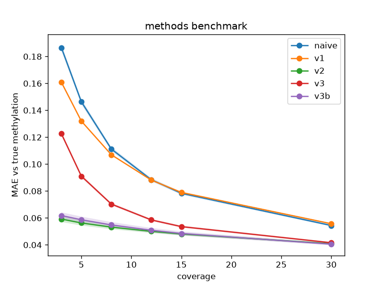

  # Low-coverage methylation estimators: a simulated benchmark

  Five Beta Binomial/empirical Bayes estimates for low coverage methylation data, scored against a simulated truth

  ## Context
  Independant prep for a cross-species rockfish epigenetic clock project. All data is simulated; magnitudes are illustrative.

  ## Methods
  All five methods use a posterior mean: p = (m+α)/(n+α+β). They differ only by the method to calculate alpha and beta.

  ## Results
  

  Shrinking toward the site mean (v2, v3b) cuts low-coverage error ~3× vs naive, with no cost at high coverage.

  ## Files
  - `simulate.py` — read-count simulator with known ground truth
  - `estimators.py` - runs one of 5 methylator shrinkage estimators
  - `benchmark.py` - how well does each method improve the estimate of p? (main experiment) 
  - `crossover.py` — does shrinkage help the clock? (secondary experiment)
  - `figures/` — benchmark plots

  ## Run
  ```bash
  conda env create -f environment.yml
  conda activate rockfish-lowcov
  python benchmark.py
  python crossover.py
  ```
